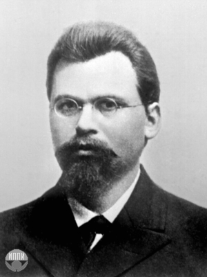
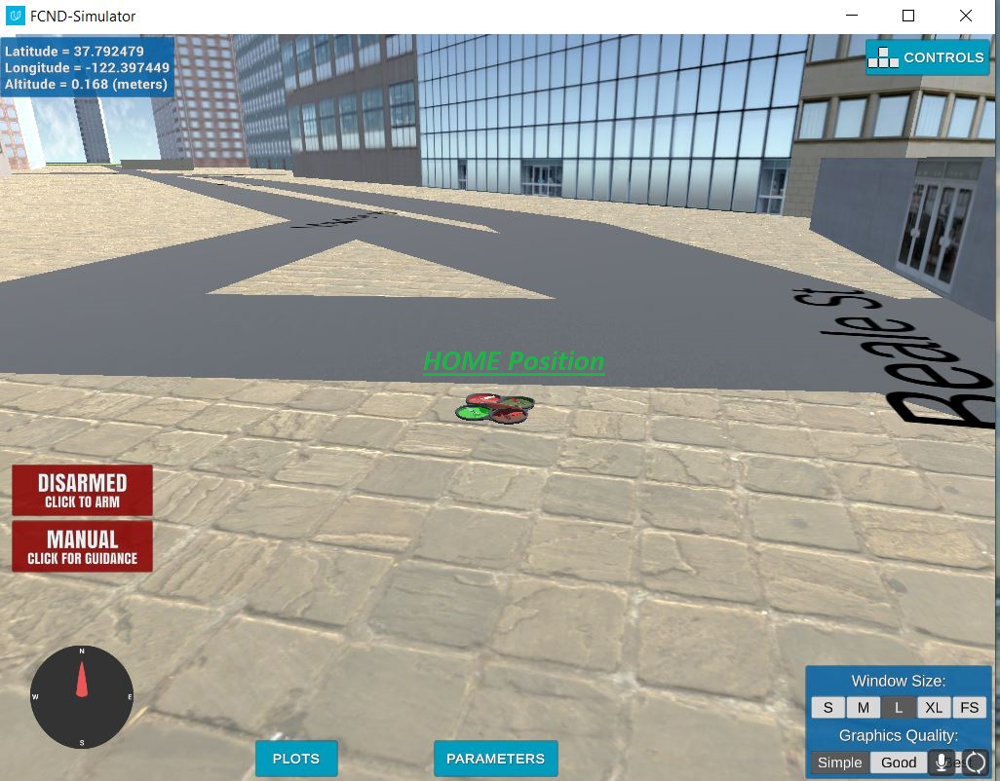
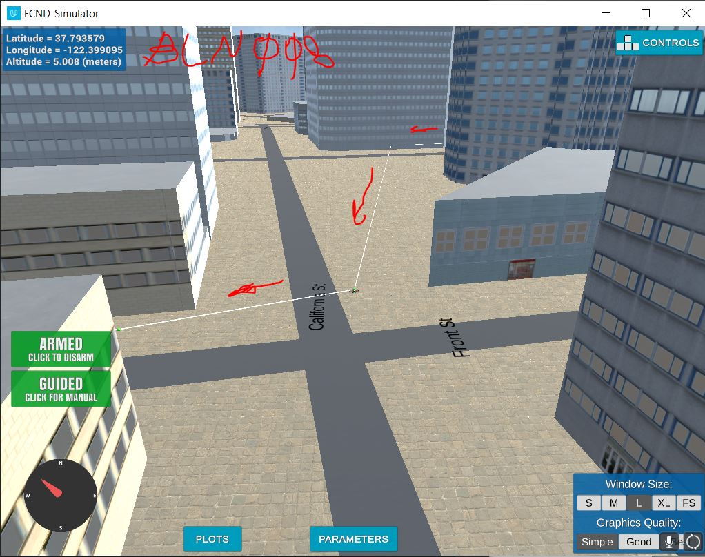

## Project: 3D Motion Planning  
___
 This work is dedicated to the memory of [Georgy Voronoi (1868 ~ 1908):](https://en.wikipedia.org/wiki/Georgy_Voronoy)   
 _" I am making great progress with the question under study [indefinite quadratic forms];   
  however, at the same time my health is becoming worse and worse.  
  Yesterday I had for the first time a clear idea of the algorithm in the theory of forms I am investigating,  
  but also suffered a strong attack of bilious colic which prevented me from working in the evening and from sleeping the whole night.  
  I am so afraid that the results of my enduring efforts, obtained with such difficulty, will perish along with me."_  
  
  
**Georgy, you and your work are live !!!**  

___


# All Required Steps for a Passing Submission have been completed:
1. Load the 2.5D map in the colliders.csv file describing the environment.
2. Discretize the environment into a grid or graph representation.
3. Define the start and goal locations.
4. Perform a search using A* or other search algorithm.
5. Use a collinearity test or ray tracing method (like Bresenham) to remove unnecessary waypoints.
6. Return waypoints in local ECEF coordinates (format for `self.all_waypoints` is [N, E, altitude, heading], where the drone’s start location corresponds to [0, 0, 0, 0].
7. Write it up.


## [Rubric](https://review.udacity.com/#!/rubrics/1534/view) Points
### Here I will consider the rubric points individually and describe how I addressed each point in my implementation.  

---
### Writeup / README

#### 1. Provide a Writeup / README that includes all the rubric points and how you addressed each one.  You can submit your writeup as markdown or pdf.  

Current document is the **Writeup**

### Explain the Starter Code
_**Spoiler:**_
- Since the simulator has a restriction / limitation , that requires some keep alive ,   
    I've moved the graph preparation part to be before the connection to the simulator


- I've decided to use a graph approach. For that purpose new file graph_utils.py has been created.


- In order to save time , I save the generated graph & and related data as pickle file,  
   so next time if the pickle file exists I use it instead of building this stuf again.


#### 1. Explain the functionality of what's provided in `motion_planning.py` and `planning_utils.py`

These scripts contain a basic planning implementation that includes...
1. Load 2.5D map  
2. Create a graph and save `[data, grid, G, north_offset, east_offset]` as a pickle file.  
3. Connect to the simulator
4. The simulation paths through the following states  
    `MANUAL` &#8594;  `GUIDED`  
    `ARMING`   
    `PLANNING` : Calculate the waypoints   
    `TAKEOFF`   
    `WAYPOINT` : Go from a waypoint to a waypoint until end    
    `LANDING`    
    `DISARMING`      
    `GUIDED` &#8594;  `MANUAL`


### Implementing the Path Planning Algorithm

#### 1. Set a global home position  
I've used _(regular expression)_ to extract the required data from the first line of the csv file.  
   ```
   # TODO: read lat0, lon0 from colliders into floating point values   
   with open('colliders.csv') as f:   
        first_line = f.readline()   
   [lat0, lon0] = [np.float(s) for s in re.findall(r"\s[-+]?(?:\d*\.*\d+)", first_line)]
   # TODO: set home position to (lon0, lat0, 0)
   self.set_home_position(lon0, lat0, 0)
   ```


The picture of the **HOME** position!

   
#### 2. Set the current local position
```
    # TODO: retrieve current global position
    global_position = np.array([self._longitude, self._latitude, self._altitude])
                # TODO: convert to current local position using global_to_local()
            local_position = global_to_local(global_position, self.global_home)
```


#### 3. Set grid start & goal positions from local position
```commandline
def find_start_goal_in_graph(G, start, goal):
    # TODO: find start and goal on skeleton

    idx = np.argmin([((start[0] - x) ** 2 + (start[1] - y) ** 2) for x, y in G.nodes])
    node_start = list(G.nodes)[idx]

    idx = np.argmin([((goal[0] - x) ** 2 + (goal[1] - y) ** 2) for x, y in G.nodes])
    node_goal = list(G.nodes)[idx]
    return node_start, node_goal
```

#### 4. Modify A* to include diagonal motion (or replace A* altogether)
The modified working `A*` code is attached to the submitted stuff. The code has been tested in the exercises.  
However , I have found the graph approach working much faster, therefore I've being used  it in my solution.  
New `graph_utils.py` file has been introduced to the project. It has the following methods :  
 
```commandline
def prepare_graph(file_name_str, TARGET_ALTITUDE, SAFETY_DISTANCE):
    '''
       This function gets a file name where the 2.5D map is aved , (TARGET_ALTITUDE) desired hovering altidue and (SAFETY_DISTANCE)  for the hovering
       It returns data, grid, G, north_offset, east_offset
    '''
    <1. Load the data from file >
    <2. Use create_grid_and_edges() to get [grid, edges,  north_offset, east_offset]
    <3. Use NetworkX to build a graph from  edges>
    return data, grid, G, north_offset, east_offset
```


```commandline
def create_grid_and_edges(data, drone_altitude, safety_distance):
    '''
       This function gets 2.5D map , desired hovering altidue and "safe distance" for the hovering
       It returns the grid , edges , north_offset , east_offset
    '''
    <1. Build grid , find centers of obstacles , find north_offset and east_offset>
    <2. Use Voronoi() algorithm  to generate ridge_vertices>
    <3. Build array of allowed edges >
       
    return grid, edges, int(north_min), int(east_min)
```

```commandline
def a_star_graph(G, h, start_n, goal_n):
    '''
       This function gets a (G)raph , (h)uristic function ,  (start_n) position, (goal_n) position   
       It returns a path and path_cost
       This function is the udoptation of the A* algorithm for a work with graphs
    '''
    <Implimintation ...>
    return path[::-1], path_cost
```

```commandline
def find_start_goal_in_graph(G, start, goal):
    '''
       This function gets a (G)raph ,  (start) and (goal) position on the grid.   
       It returns the apropriate  start & goal nodes on the graph
       This function is the udoptation of the A* algorithm for a work with graphs
    '''
    <Implimintation ...>
    return node_start, node_goal
```

```commandline
def is_hit(grid, p1, p2, north_offset ,east_offset):
    '''
       This function gets grid, point1, point2, north_offset ,east_offset 
       It checks if the points can be safetly connected without hitting an ostcal  
       It returns the hit status
    '''
    <Implimintation ...>

    return hit
```

```commandline
def path_pruning(grid, waypoints, north_offset, east_offset):
   '''
       This is my (Leonid Nikolaev bln008@gmail.com) algorithm (perhaps I'm not the first of thinking this thought :) )   
       The idea :   
       Check if you can connect the first point to the one of the latest possible points. 
       If it is possible , drop out the intermediate points.   
       Do it recursively for remaining points.
   '''
    return pruned_path
```

#### 5. Cull waypoints 
I use the path_pruning() with my algorithm to prune the nuber of waypoints.
In this particular scenario the 32 waypoints have been pruned to only 5.  
```Looks good to me :)```

### Execute the flight
#### 1. Does it work?  
  
**It works!**
